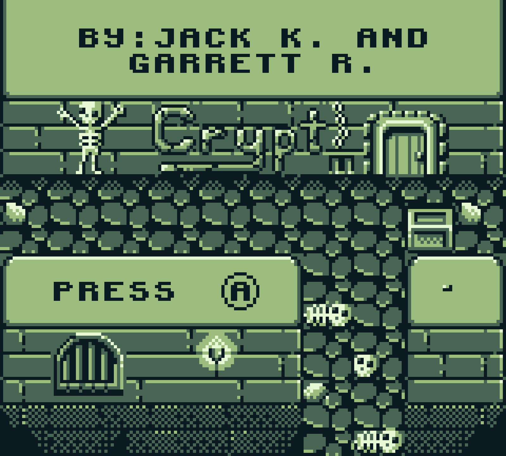

# Crypt
Crypt is survial game for the Nintendo Game Boy, made by [Jack Kertscher](https://github.com/JackKertscher) and [Garrett Rhoads](https://github.com/Ilphu) for CPSCI-240: Computer Architecture in the fall of 2024 at Hamilton College. 

<p align="center">
  
</p>


## Gameplay
- You are an explorer who is lost in a dungeon, you need to survive waves of zombies to escape.
- Move with the d-pad and sprint with b, but be careful you can't sprint forever.
- Survivie by running away from the zombies until the timer runs out! Good luck!

## Build Instructions
You need have to `make` and `RGBDS` installed. Instructions for installing `RGBDS` can be found [here](https://rgbds.gbdev.io/install). If unix like system, you can use a package manager like `apt` to install `make` by typing the following into your terminal:
```
sudo apt-get install make
```
First, clone the repository:
```
git clone https://github.com/Ilphu/crypt.git
```
Change into the game's directory and make the game:
```
cd crypt
make
```
After this, you should see `crypt.gb` in the directory.

## Acknowledgements
- Thanks to Maximilien Dagois's [Game Boy Coding Adventure](https://mdagois.gumroad.com/l/CODQn), we were able to easily and effectively learn how to develop Game Boy games.
- Thanks to Professor Darren Strash for his incredible instruction in CPSCI-240 and feedback on this game.
- Assets acknowledgements are in the LICENSE file.
